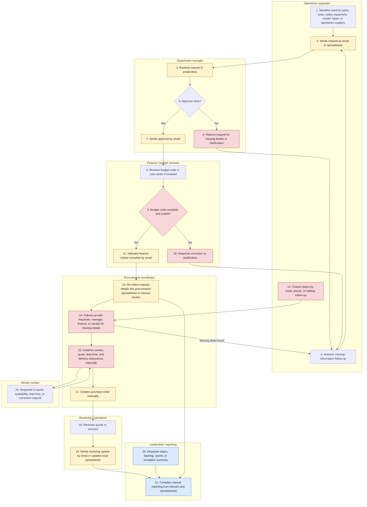

# Current-State Procurement Process

## How To Read This Artifact

This process map shows the current procurement request workflow for HarbourPoint Marine Services, a fictional marine services and logistics company in St. John's, Newfoundland and Labrador. It is designed for a synthetic Business Analyst portfolio case and does not represent real company data, vendor data, client delivery, or production ERP configuration.

Read the Mermaid map first to understand the main handoffs. Then use the pain-point table to see where the current email and spreadsheet process creates delay, rework, unclear status, and inconsistent reporting.

## Current-State Process Map

## Swimlane Step Summary

| Step | Role | Current activity | Main issue |
|---|---|---|---|
| 1-2 | Operations requester | Submits a purchase request by email or spreadsheet. | Request information arrives in inconsistent formats. |
| 3-7 | Department manager | Reviews and approves by email, or returns the request for clarification. | Approval status is hard to track once emails split into separate threads. |
| 8-11 | Finance / budget reviewer | Reviews budget code or cost centre when enough information is available. | Missing or unclear budget codes delay the request and weaken reporting. |
| 12-15 | Procurement coordinator | Re-enters details, checks completeness, and follows up with requesters, managers, finance, and vendors. | Manual rework and repeated follow-up slow down PO preparation. |
| 16 | Vendor contact | Provides quote, availability, lead time, or correction details. | Vendor follow-up sits outside a shared status view. |
| 17 | Procurement coordinator | Creates the purchase order manually after approvals and details are assembled. | PO creation depends on manually collected information. |
| 18-19 | Receiving / operations | Confirms receipt by email or local spreadsheet update. | Receiving status may not be visible to requesters, managers, finance, or procurement. |
| 20-21 | Leadership / reporting | Requests and receives manual summaries from inboxes and spreadsheets. | Reporting is inconsistent, delayed, and difficult to reconcile. |

## Pain Points And Bottlenecks

| Process area | Pain point | Business impact |
|---|---|---|
| Request intake | Requests are sent by email or spreadsheet with different fields, wording, and attachment habits. | Procurement and finance spend time interpreting the request before review can begin. |
| Missing information loop | Request details such as vendor, quote, budget code, needed-by date, or business reason may be missing. | The request returns to the requester and may restart through a new email thread. |
| Manager approval | Approval is captured in email rather than a shared queue. | Requesters and procurement may not know whether a request is pending, approved, returned, or rejected. |
| Budget code review | Budget codes can be missing, inactive, inconsistent with the category, or hard to validate. | Finance review becomes a bottleneck, and later spend reporting is less reliable. |
| Procurement follow-up | Procurement manually chases missing details, vendor lead time, quotes, and delivery instructions. | Coordinators spend time on administrative follow-up instead of preparing clean PO handoffs. |
| Vendor communication | Vendor status is tracked through separate emails. | Delays and changes are not visible in one shared request record. |
| Manual PO creation | The purchase order is prepared after information is copied from email and spreadsheets. | Manual re-entry increases the chance of errors and duplicated work. |
| Requester status follow-up | Requesters follow up manually for approval, PO, delivery, and receiving status. | Status questions interrupt managers, finance, procurement, and receiving teams. |
| Receiving update | Receiving confirmation is sent by email or maintained locally. | Request status and delivery status can be confused or left incomplete. |
| Manual reporting | Leadership reporting is assembled from inboxes, trackers, and local spreadsheets. | Backlog, aging, cycle time, exception reasons, and category/vendor spend may not reconcile consistently. |

## Bottlenecks To Carry Into Future-State Design

- Missing budget codes need to be caught earlier in the request lifecycle.
- Approval status needs to be visible without searching email threads.
- Vendor follow-up delays need a clear status or hold reason.
- Procurement rework should be reduced by standardizing intake fields.
- Request status and receiving status should be tracked separately.
- Leadership needs reporting based on consistent status values, not manual spreadsheet interpretation.

## Business Analyst Value Shown

This artifact translates a messy operational process into a shared business view. It shows where HarbourPoint's current email and spreadsheet workflow creates rework, unclear ownership, weak status visibility, and inconsistent reporting. The map gives stakeholders a practical baseline for discussing future-state workflow requirements without claiming that a real ERP system has been configured.
