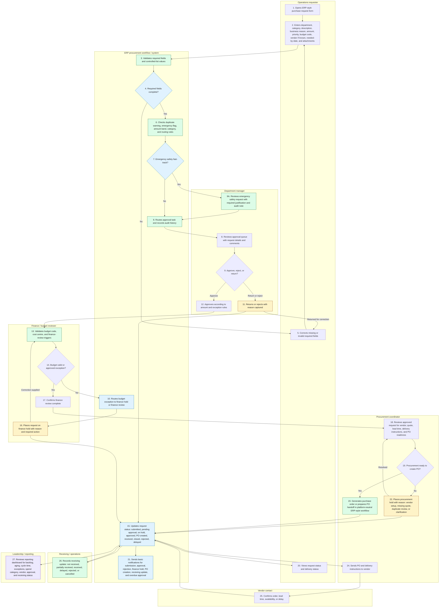

# Future-State Procurement Process

## How To Read This Artifact

This process map shows a proposed platform-neutral ERP-style procurement workflow for HarbourPoint Marine Services, a fictional marine services and logistics company in St. John's, Newfoundland and Labrador. It is designed for a synthetic Business Analyst portfolio case and does not claim that SAP, Oracle, Microsoft Dynamics, NetSuite, or any other named ERP product has been configured.

Read the Mermaid map first to understand the intended request-to-purchase-order flow. Then review the controls and improvement tables to see how the future state addresses current email, spreadsheet, approval, budget, status, receiving, and reporting pain points.

## Future-State Process Map

## Planned Status Concepts

| Status type | Example values | Purpose |
|---|---|---|
| Request status | Submitted, pending approval, returned, rejected, finance hold, procurement hold, approved, PO created, closed, delayed | Shows where the request is in the business workflow. |
| Delivery status | Not ordered, ordered, not received, partially received, received, delayed, rejected, cancelled | Shows fulfillment progress after procurement action. |

Keeping request status and delivery status separate prevents an approved request from being mistaken for a received item or service.

## Future-State Improvements

| Current issue addressed | Future-state improvement | Expected business value |
|---|---|---|
| Inconsistent email and spreadsheet intake | Standard ERP-style purchase request form with controlled fields. | Cleaner request information before approval, finance review, or procurement review begins. |
| Missing request details | Required-field validation before normal submission. | Less avoidable back-and-forth with requesters. |
| Unclear approval status | Approval routing and manager queue with captured decision comments. | Requesters and procurement can see whether approval is pending, returned, rejected, or approved. |
| Missing or invalid budget codes | Budget validation and finance hold path. | Finance issues become visible earlier and are tracked with reason codes. |
| Vendor follow-up delays | Procurement hold reasons for vendor setup, missing quote, duplicate review, or clarification. | Delays can be categorized instead of hidden in email threads. |
| Manual PO rework | PO generation or PO handoff after approvals and required details are complete. | Procurement works from a cleaner request record. |
| Poor requester visibility | Requester view of request status and delivery status. | Fewer manual status follow-ups. |
| Inconsistent receiving updates | Receiving update captured against the request or PO record. | Operations, procurement, and managers share a clearer fulfillment view. |
| Manual reporting | Dashboard fed by consistent request, exception, approval, procurement, and receiving status values. | Leadership can review backlog, aging, cycle time, exceptions, spend, and receiving status more consistently. |

## Controls Represented

| Control | How it works in the proposed workflow |
|---|---|
| Required-field validation | Normal submission requires key fields such as department, category, description, business reason, amount, priority, budget code, needed-by date, and vendor when known. |
| Controlled-list values | Departments, categories, budget codes, vendors, priorities, status values, and hold reasons use standard values where practical. |
| Amount-based approval routing | Requests route based on the documented approval bands: under CAD 1,000, CAD 1,000 to CAD 9,999, and CAD 10,000 and above. |
| Approval decision capture | Approvals, returns, and rejections include user, timestamp, decision, and comment history. |
| Finance budget validation | Invalid, inactive, missing, or inconsistent budget codes route to finance review or finance hold instead of being handled informally by email. |
| Emergency safety fast-track | Emergency safety requests can receive faster routing, but the workflow still captures justification, audit notes, approval history, and finance visibility where required. |
| Duplicate warning | Similar recent requests can be flagged for review without automatically blocking legitimate maintenance needs. |
| Procurement readiness check | Procurement confirms vendor, quote, lead time, delivery instructions, and PO readiness before PO generation or handoff. |
| Hold reason tracking | Finance and procurement holds use reason codes so exception reporting is consistent. |
| Basic notifications | Users receive practical notifications for submission, approval, rejection, finance hold, PO creation, receiving update, and overdue approval. |
| Audit trail | Request submission, approval, finance review, PO creation, receiving updates, holds, comments, and status changes are traceable. |
| Reporting dashboard | Leadership and managers can review backlog, aging, cycle time, approval bottlenecks, exception reasons, vendor/category spend, and receiving status. |

## Assumptions Carried Into Requirements And UAT

- The initial pilot remains focused on Maintenance procurement requests such as parts, tools, safety equipment, maintenance services, vendor repairs, and operations supplies.
- Approval thresholds, budget-code validation rules, and emergency safety handling are documented in the requirements, business rules, approval matrix, backlog, and UAT artifacts. Delegation rules remain an open policy detail.
- The workflow remains platform-neutral and should be translated into a named ERP product only in a real implementation context.
- Vendor master lookup, budget code reference data, user roles, and reporting extracts are assumed to exist at a basic pilot-ready level.
- Payment processing, full accounting integration, inventory management, and detailed warehouse receiving remain outside the initial workflow.

## Business Analyst Value Shown

This artifact turns the current procurement pain points into a practical future-state workflow that connects to the requirements, backlog, UAT, reporting, and rollout artifacts in the completed portfolio package. It shows how a junior BA can define intake, routing, finance review, procurement review, PO handoff, receiving visibility, exceptions, notifications, audit expectations, and reporting needs without overstating real ERP configuration experience.
